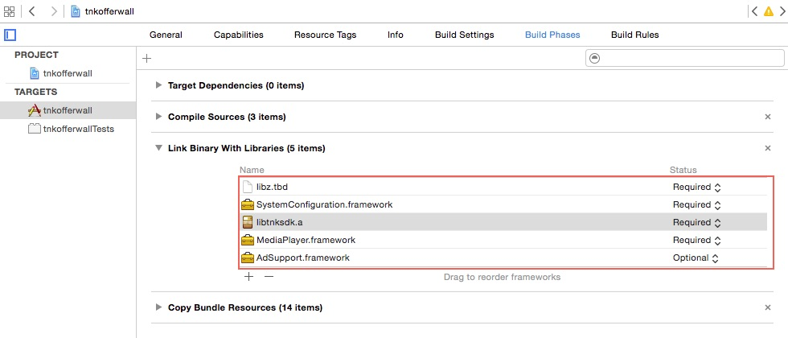
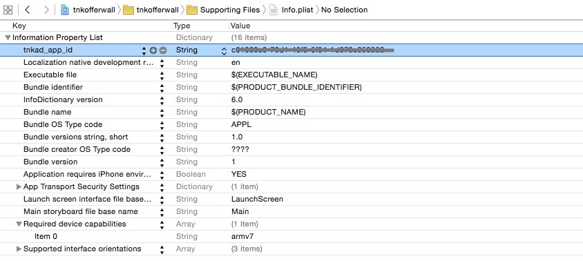
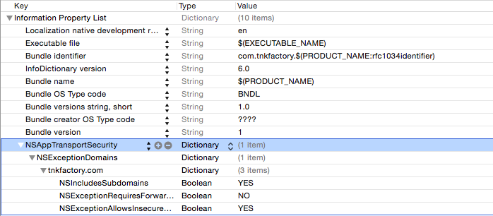

# Tnkfactory SDK

## 목차

1. [SDK 설정하기](#1-sdk-설정하기)

   * [라이브러리 다운로드](#라이브러리-다운로드)
   * [라이브러리 등록](#라이브러리-등록) 
   * [Tnk 객체 초기화](#tnk-객체-초기화)
     * [초기화 API를 호출하는 방법](#초기화-api를-호출하는-방법)
     * [info.plist 파일에 APP_ID를 설정하는 방법](#infoplist-파일에-app_id를-설정하는-방법)
   * [App Transport Security 설정](#app-transport-security-설정)
2. [Interstitial Ad](#2-interstitial-ad)
   * [TnkInterstitialAd 객체](#tnkinterstitialad-객체)
   * [Display Logic](#display-logic)
   * [Delegate 이용하기](#delegate-이용하기)
   * [TnkInterstitialAd Interface](#tnkinterstitialad-interface)
     * [properties](#properties)
     * [prepare](#prepare)
     * [show](#show)
   * [화면 Orientation](#화면-orientation-처리)
3. [Native Ad](#3-native-ad)
   - [TnkNativeAd Loading](#tnknativead-loading)
   - [NativeAd 표시하기](#nativead-표시하기)
   - [NativeAd 클릭처리](#nativead-클릭처리)
   - [TnkNativeAdDelegate](#tnknativeaddelegate)
   - [TnkNativeAd Interface](#tnknativead-interface)
     - [properties](#properties-1)
     - [Ad Style](#ad-style)
     - [prepare](#prepare-1)
     - [Native Ad 항목 가져오기](#native-ad-항목-가져오기)
     - [Attach & Detach Layout](#attach--detach-layout)
4. [Video Ad](#4-video-ad)
   - [Loading a Video Ad](#loading-a-video-ad)
   - [TnkVideoDelegate](#tnkvideodelegate)
   - [Video Ad Sample](#video-ad-sample)
   - [세로화면 앱](#세로화면-앱)
   - [Video Ad APIs](#video-ad-apis)
     - [TnkSession - prepareVideoAd:](#tnksession---preparevideoad)
     - [TnkSession - showVideoAd:](#tnksession---showvideoad)
     - [TnkSession - hasVideoAd:](#tnksession---hasvideoad)
     - [기타](#기타)

## 1. SDK 설정하기

### 라이브러리 다운로드

**[[SDK Download v4.21](http://cdn1.tnkfactory.com/tnk/sdk/tnkad_sdk_ios_v4.21.zip)]**

### 라이브러리 등록

TnkAd SDK를 사용하기 위해서는 다운 받으신 Tnk SDK내에 들어있는 

- libtnksdk.a 파일과 tnksdk.h 파일을 XCode 프로젝트에 추가하셔야합니다.
- 그리고 TnkAd SDK에서 필요로하는 다음의 라이브러리 들을 같이 XCode 프로젝트에 추가해주시기 바랍니다.

| 라이브러리                    | 용도                                                         |
| ----------------------------- | ------------------------------------------------------------ |
| libtnksdk.a                   | TnkAd SDK 라이브러리                                         |
| libz.tbd                      | 압축라이브러리 (TnkAd SDK가 서버통신시 사용함)               |
| MediaPlayer.framework         | 동영상 광고 표시를 위하여 사용됨                             |
| AdSupport.framework           | IdfA 값 획득을 위하여 사용됨 (반드시 Optional 모드로 추가해야 한다.) |
| SystemConfiguration.framework | Wifi 연결상태를 확인하기 위하여 사용됨                       |

**중요) 앱스토어 정책상 앱 보상형광고가 노출되는 경우 검수가 되지 않습니다.** 
**보상형 매체로 사용하시는 경우에는 앱 광고가 노출되지 않도록 앱스토어 검수전에 매체 설정이 필요하므로 사전에 저희쪽에 문의해주시면 안내해드리겠습니다.**



### Tnk 객체 초기화

TnkAd SDK 사용전에 반드시 TnkSession 객체를 초기화해야 합니다. TnkSession 초기화는 2가지 방법을 제공합니다. 아래 2가지 방법 중 하나를 선택하시어 진행하시면 됩니다.

#### 초기화 API를 호출하는 방법

Application Delegate 내의 applicationDidFinishLaunchingWithOption 메소드 내에 아래와 같이 초기화 로직을 넣어주십시요.

 **\* APP_ID 값은 Tnk 사이트에서 앱 등록하면 발급받으실 수 있습니다. 이 값을 아래 초기화 로직의 your-application-id-from-tnk-site 부분에 넣어주셔야합니다.**

```objective-c
#import "tnksdk.h"

- (BOOL)application:(UIApplication *)application didFinishLaunchingWithOptions:(NSDictionary *)launchOptions
{
    // Tnk 초기화
    [TnkSession initInstance:@"your-application-id-from-tnk-site"];

    // ...
}
```

#### info.plist 파일에 APP_ID를 설정하는 방법

Xcode 프로젝트의 info.plist 파일을 찾아서 아래와 같이 "tnkad_app_id" 항목을 추가하고 APP_ID 값을 설정합니다. 이곳에 설정해두면 TnkSession 객체가 처음 사용되는 시점에 자동으로 초기화 됩니다.

 **\* APP_ID 값은 Tnk 사이트에서 앱 등록하면 발급받으실 수 있습니다. 이 값을 아래 화면과 같이 Value 항목에 설정합니다.**



### App Transport Security 설정

SDK v4.05 부터는 모든 통신이 HTTPS 로 이루어지므로 아래의 ATS 관련 설정을 하실 필요가 없습니다.
다만 SDK v4.04 이하 버전의 경우에는 iOS9 에서 SDK 가 올바르게 동작하기 위해서 아래의 내용을 앱의 plist 파일에 반드시 설정해주어야 합니다.

NSAppTransportSecurity 를 키로 Dictionary 값 NSExceptionDomains 을 등록하여 하위에 tnkfactory.com 을 설정합니다. 자세한 내용은 아래의 예시를 참고하세요.

#### iOS9 APP Transport Security 설정하기

```xml
<key>NSAppTransportSecurity</key>
<dict>
<key>NSExceptionDomains</key>
<dict>
<key>tnkfactory.com</key>
<dict>
<key>NSIncludesSubdomains</key>
<true/>
<key>NSExceptionRequiresForwardSecrecy</key>
<false/>
<key>NSExceptionAllowsInsecureHTTPLoads</key>
<true/>
</dict>
 </dict>
</dict>
```



## 2. Interstitial Ad

### TnkInterstitialAd 객체

전면광고를 띄우는 작업은 1) TnkInterstitialAd 객체 생성, 2) prepare 호출 3) show 호출 의 3단계를 통해서 이루어 집니다. 아래는 비보상 전면 광고를 띄우기 위한 가장 간단한 예제입니다.

> TnkInterstitialAd

```objective-c
@implementation ViewController {
    TnkInterstitialAd *tnkInterstitial;
}

- (void)viewDidLoad {
    [super viewDidLoad];

    // 1) 전면광고 용 객체 생성
    tnkInterstitial = [[TnkInterstitialAd alloc] init];

    // 2) 전면광고 요청
    [tnkInterstitial prepare];

    // 3) 전면광고 화면의 띄우기
    [tnkInterstitial show];

}
```

만약 보상형 전면광고를 띄우고자 할 경우에는 prepare 호출시 TNK_PPI 파라메터를 전달하시면 됩니다.

> Incentive Ad Sample

```objective-c
@implementation ViewController {
    TnkInterstitialAd *tnkInterstitial;
}

- (void)viewDidLoad {
    [super viewDidLoad];

    // 1) 전면광고 용 객체 생성
    tnkInterstitial = [[TnkInterstitialAd alloc] init];

    // 2) 전면광고 요청 (보상형 전면광고)
    [tnkInterstitial prepare:TNK_PPI];

    // 3) 전면광고 화면의 띄우기
    [tnkInterstitial show];

}
```

### Display Logic

보상형 또는 비보상형 전면 광고를 앱 내에 고정하여 코딩하시는 경우 해당 전면광고를 제어할 수 있는 방법이 없으므로 보다 효과적으로 관리하기 위하여 Display Logic을 사용하실 것을 권장합니다. Display Logic 을 사용하시려면 로직 명칭을 prepare 호출시 파라메터로 전달합니다.

Display Logic을 사용하시면 전면 광고 노출기간, 빈도수, 광고의 종류 등을 자유롭게 제어하실 수 있습니다. 또한 타사와 크로스 광고를 진행하시고자 할 경우에는 Display Logic을 반드시 적용하여야 합니다. 

> Display Logic Sample

```objective-c
@implementation ViewController {
    TnkInterstitialAd *tnkInterstitial;
}

- (void)viewDidLoad {
    [super viewDidLoad];

    // 1) 전면광고 용 객체 생성
    tnkInterstitial = [[TnkInterstitialAd alloc] init];
   
    // 2) 전면광고 요청 (Display Logic 지정)
    [tnkInterstitial prepare:@"cross_first"];

    // 3) 전면광고 화면의 띄우기
    [tnkInterstitial show];

}
```

### Delegate 이용하기

전면광고의 로딩이 완료되거나 사용자가 전면광고 화면을 닫는 경우 해당 이벤트 발생시점에 필요한 로직을 구현하기 위해서
아래의 TnkInterstitialDelegate 프로토콜을 이용할 수 있습니다.

> TnkInterstitialDelegate protocol

```objective-c
// Interstitial TnkAdViewDelegate 관련 상수값 정의
#define AD_CLOSE_SIMPLE     0   // 사용자가 닫기버튼을 눌러서 광고화면을 닫은 경우
#define AD_CLOSE_CLICK      1   // 사용자가 광고를 클릭해서 화면이 닫히는 경우

#define AD_FAIL_NO_AD       -1  // no ad available
#define AD_FAIL_NO_IMAGE    -2  // ad image not available
#define AD_FAIL_TIMEOUT     -3  // ad arrived after 5 secs.
#define AD_FAIL_CANCEL      -4  // ad frequency settings
#define AD_FAIL_NOT_PREPARED     -5      // not prepared

#define AD_FAIL_SYSTEM      -9

#define TNK_PPI             @"__tnk_ppi__"
#define TNK_CPC             @"__tnk_cpc__"

@protocol TnkInterstitialDelegate <NSObject>

@optional

// 전면광고 화면 닫힐 때 호출됩니다. 해당 객체와 화면이 닫히는 이유를 파라메터로 전달해 줍니다.
- (void)didInterstitialClose:(TnkInterstitialAd *)ad close:(int)type;

// 전면 광고를 화면에 띄우지 못했을 경우 호출됩니다.
// 시스템 오류나 광고가 없어서 광고를 띄우지 못했을 경우,
// 광고가 늦게 도착하여 광고가 뜨지 않은 경우 등 해당 사유가 파라메터로 전달됩니다.
- (void)didInterstitialFail:(TnkInterstitialAd *)ad error:(int)errCode;

// 전면광고 화면이 나타나는 시점에 호출됩니다.
- (void)didInterstitialShow:(TnkInterstitialAd *)ad;

// 전면 광고 prepare: API 호출 후 show: API 호출 전에 광고가 도착하면 호출됩니다.
// 만약 광고 도착 전에 show: API 가 먼저 호출된 경우에는 나중에 광고가 도착하였을 때
// 바로 광고가 표시되고 didInterstitialShow:가 호출됩니다.
- (void)didInterstitialLoad:(TnkInterstitialAd *)ad;

@end
```

TnkInterstitialDelegate는 prepare 호출시 두번째 파라미터로 지정하거나 TnkInterstitialAd 객체에 별도로 지정할 수 있습니다. 

아래의 예시는 TnkInterstitialDelegate를 사용하여 광고가 로딩되는 시점에 앱의 상태를 판단하여 광고를 띄울지 말지 결정하는 방식의 구현 예시입니다.

> TnkAdViewDelegate Sample

```objective-c
#import "tnksdk.h"

@interface ViewController : UIViewController <TnkInterstitialDelegate> {
    // ...
}
@end

@implementation ViewController {
    TnkInterstitialAd *tnkInterstitial;
}

- (void)viewDidLoad {
    [super viewDidLoad];

    // 1) 전면광고 용 객체 생성
    tnkInterstitial = [[TnkInterstitialAd alloc] init];

    // 2) 전면광고 요청 (Delegate 지정하여 호출함)
    [tnkInterstitial prepare:@"cross_first" delegate:self];
}

#pragma mark - TnkInterstitialDelegate

- (void) didInterstitialLoad:(TnkInterstitialAd *)ad {
    NSLog(@"Interstitial Loaded : %@", ad.logicName);

    if (okToShow) {
        // 전면광고를 화면에 띄운다.
        [ad show];
    }
}
```

### TnkInterstitialAd Interface

```objective-c
@interface TnkInterstitialAd : NSObject <TnkServiceCallback>

@property (nonatomic, weak) UIViewController *viewControllerToShow;
@property (nonatomic, weak) id<TnkInterstitialDelegate> delegate;
@property (nonatomic, strong) NSString *logicName;
@property (nonatomic, assign) NSTimeInterval timeoutSec;

- (void) prepare;
- (void) prepare:(NSString *)logicName;
- (void) prepare:(NSString *)logicName delegate:(id<TnkInterstitialDelegate>) delegate;

- (void) show:(UIViewController *)viewController;
- (void) show;

@end
```

#### properties

| Property             | 내용                                                         |
| -------------------- | ------------------------------------------------------------ |
| logicName            | 전면광고를 가져오기 위한 Display Logic 명칭을 설정합니다. Display Logic 을 지정하면 Tnk 사이트에서 원하는 형태의 광고를 띄우도록 제어할 수 있습니다. ( [[Display Logic\]](http://docs.tnkad.net/tnk-interstitial-ad/3-display-logic) 참고) Display Logic을 사용하지 않는 경우 보상형 광고의 경우에는 TNK_PPI, 비보상형 광고의 경우에는 TNK_CPC (기본값) 를 넣어줍니다. |
| delegate             | TnkInterstitialDelegate 객체를 지정합니다.                   |
| viewControllerToShow | 전면광고를 노출할 UIViewController 객체를 지정합니다. 설정하지 않은 경우에는 현재 UIWindow의 rootViewController 를 사용합니다. |
| timeoutSec           | 전면광고 로딩의 timeout 값을 지정합니다. (기본 5초) show 가 호출된 후 지정한 timeoutSec 이내에 광고가 로딩되지 않는 경우에는 TnkInterstitialDelegate의 didInterstitialFail:error: 가 호출됩니다. 이때 errorCode 는 -3 (AD_FAIL_TIMEOUT) 가 전달됩니다. |

#### prepare

##### Method

  - (void) prepare
  - (void) prepare: (NSString *) logicName
  - (void) prepare: (NSString *) logicName delegate: (id<TnkInterstitialDelegate>) delegate

##### Description

전면광고를 서버에서 한건 로딩합니다. logicName 과 delegate 파라메터는 properties에 설명된 것과 같습니다. 

- 전면광고가 로딩이 완료되면 delegate의 didInterstitialLoad: 가 호출되며 
- 로딩이 실패하면 didInterstitialFail:error: 가 호출됩니다. 
- 만약에 prepare 를 호출하고 로딩된 광고가 화면에 표시되기 전에 다시 prepare 를 호출하면 그 prepare는 무시됩니다. 

#### show

##### Method

  - (void) show
  - (void) show: (UIViewController *) viewController

##### Description

prepare 를 호출하여 로딩된 전면광고를 화면에 띄웁니다. viewController를 지정하면 viewController.view 에 전면광고를 띄우며, 지정하지 않은 경우에는 현재 UIWindow 를 이용하여 내부적으로 viewController 객체를 판단하여 띄웁니다. 

- 전면광고가 화면에 나타나면 delegate의 didIntersititalShow: 가 호출되며, 
- 전면광고가 닫히게 되면 didInterstitialClose:type: 이 호출됩니다. 이때 사용자가 닫기버튼을 클릭하여 닫혔는지(0, AD_CLOSE_SIMPLE) 또는 전면광고를 클릭하여 닫혔는지(1, AD_CLOSE_CLICK) 여부가 type 파라메터로 전달됩니다. 
- 만약 이전에 prepare 를 호출하지 않은 상태에서 show를 호출하게되면 didInterstitialFail:error: 가 호출되며 errorCode는 -5(AD_FAIL_NOT_PREPARED) 가 전달됩니다. 
- 또한 설정된 전면광고 노출 간격 시간 이내에 show가 호출되면 didInterstitialFail:error: 가 호출되며 이때 errorCode 는 -4 (AD_FAIL_CANCEL) 가 전달됩니다.

### 화면 Orientation 처리

화면의 방향을 세로 또는 가로로 고정하지 않은 경우 전면광고 노출된 상태에서 화면이 회전하게 되면 전면광고가 닫히도록 아래와 같이 코딩을 하셔야합니다.

```objective-c
// for iOS 5,6,7
- (void) willRotateToInterfaceOrientation:(UIInterfaceOrientation)toInterfaceOrientation duration:(NSTimeInterval)duration {
    [[TnkSession sharedInstance] removeCurrentInterstitialAd];
    // 또는 아래와 같이 호출 (show 호출 방식에 맞추어 호출합니다.)
    // [[TnkSession sharedInstance] removeCurrentInterstitialAd:self];
}

// for iOS 8,9
- (void) viewWillTransitionToSize:(CGSize)size withTransitionCoordinator:(id<UIViewControllerTransitionCoordinator>)coordinator {
    [[TnkSession sharedInstance] removeCurrentInterstitialAd];
    // 또는 아래와 같이 호출 (show 호출 방식에 맞추어 호출합니다.)
    // [[TnkSession sharedInstance] removeCurrentInterstitialAd:self];
}
```

## 3. Native Ad

### TnkNativeAd Loading

아래와 같이 호출하여 Landscape 형태의 소재이미지를 사용하는 Native Ad를 로딩할 수 있습니다.

> NativeAdItem

```objective-c
#import "tnksdk.h"

@interface ViewController : UIViewController <TnkNativeAdDelegate> {
    // ...
}
@end

@implementation ViewController {
    TnkNativeAd *tnkNative;
}

- (void)viewDidLoad {
    [super viewDidLoad];

    // 1) Native Ad 광고용 객체 생성
    tnkNative = [[TnkNativeAd alloc] init];
    tnkNative.adStyle = AD_STYLE_LANDSCAPE;  // 가로 이미지 가져오도록 설정한다.

    // 2) 네이티브 광고 한건 가져온다.
    [tnkNative prepare:@"cross_first" delegate:self];
}

#pragma mark - TnkNativeAdDelegate

- (void) didNativeAdLoad:(TnkNativeAd *)ad {
    NSLog(@"Native Ad Loaded : %@", ad.logicName);

    // Rendering native Ad

}
```

### NativeAd 표시하기

Native Ad 데이터가 로딩되면 TnkNativeAdDelegate의 didNativeAdLoad: 메소드가 호출되며 이때 TnkNativeAd 객체가 파라메터로 전달됩니다.
전달된 TnkNativeAd 객체가 제공하는 데이터를 사용하여 Native Ad를 화면에 표시합니다.

> Rendering Native Ad

```objective-c
#pragma mark - TnkNativeAdDelegate

- (void) didNativeAdLoad:(TnkNativeAd *)ad {
    NSLog(@"Native Ad Loaded : %@", ad.logicName);

    // Rendering native Ad
    [self.coverImageView setImage:[ad getCoverImage]];
    [self.iconImageView setImage:[ad getIconImage]];
    [self.titleLabel setText:[ad getTitle]];
    [self.descLabel setText:[ad getDescription]];

    [ad attachLayout:self.coverImageView];
}
```

광고가 화면에 노출될 때의 Impression 처리는 SDK에서 자동으로 처리됩니다. 이를 위해서는 Native Ad를 화면에 표시하고 있는 UIView 객체를 TnkNativeAd의 attachLayout: 메소드를 사용하여 지정해야합니다.
로딩된 Native 광고가 더 이상 필요하지 않는 경우에는 detachLayout을 호출한 후 TnkNativeAd 객체를 재 사용할 수 있습니다.

### NativeAd 클릭처리

사용자가 Native Ad를 클릭하였을때 광고 페이지로 이동하는 것은 2가지 방법이 있습니다. 첫번째는 attachLayout:clickView: 메소드를 사용하여 attachLayout 의 두번째 파라메터로 클릭 이벤트를 처리할 UIView를 지정하는 방법입니다. 이때에 사용자가 clickView로 지정한 UIView 를 tap 할 경우 자동으로 광고 페이지로 이동합니다. 두번째 방법은 클릭 처리를 직접 코딩하는 방법입니다. 클릭 이벤트 발생시 TnkNativeAd 객체의 handleClick 메소드를 호출합니다.

> Native Ad Click #1

```objective-c
#pragma mark - TnkNativeAdDelegate

- (void) didNativeAdLoad:(TnkNativeAd *)ad {
    NSLog(@"Native Ad Loaded : %@", ad.logicName);

    // Rendering native Ad
    [self.coverImageView setImage:[ad getCoverImage]];
    [self.iconImageView setImage:[ad getIconImage]];
    [self.titleLabel setText:[ad getTitle]];
    [self.descLabel setText:[ad getDescription]];

    // AttachLayout의 두번째 파라미터로 클릭대상 View를 지정한다.
    [ad attachLayout:self.coverImageView clickView:self.coverImageView];
}
```

> Native Ad Click #2

```objective-c
#pragma mark - TnkNativeAdDelegate

- (void) didNativeAdLoad:(TnkNativeAd *)ad {
    NSLog(@"Native Ad Loaded : %@", ad.logicName);

    // Rendering native Ad
    [self.coverImageView setImage:[ad getCoverImage]];
    [self.iconImageView setImage:[ad getIconImage]];
    [self.titleLabel setText:[ad getTitle]];
    [self.descLabel setText:[ad getDescription]];

    [ad attachLayout:self.coverImageView];
}

// 클릭 이벤트 발생기 handleClick 메소드를 호출한다.
- (IBAction) didNativeAdButtonPressed:(id)sender {
    [tnkNative handleClick];
}
```

### TnkNativeAdDelegate

Native Ad의 로딩이 완료되거나 화면에 노출되는 경우 또는 사용자가 광고를 클릭하는 경우 해당 이벤트 발생시점에 필요한 로직을 구현하기 위해서
아래의 TnkNativeAdDelegate 프로토콜을 구현합니다.

> TnkNativeAdDelegate Protocol

```objective-c
#define AD_FAIL_NO_AD       -1  // no ad available
#define AD_FAIL_NO_IMAGE    -2  // ad image not available
#define AD_FAIL_TIMEOUT     -3  // ad arrived after 5 secs.

#define AD_FAIL_SYSTEM      -9

@protocol TnkNativeAdDelegate <NSObject>

@optional

- (void) didNativeAdFail:(TnkNativeAd *)ad error:(int)errCode;
- (void) didNativeAdLoad:(TnkNativeAd *)ad;
- (void) didNativeAdClick:(TnkNativeAd *)ad;
- (void) didNativeAdShow:(TnkNativeAd *)ad;

@end
```

### TnkNativeAd Interface

```objective-c
@interface TnkNativeAd : NSObject <TnkServiceCallback>

@property (nonatomic, weak) id<TnkNativeAdDelegate> delegate;
@property (nonatomic, strong) NSString *logicName;
@property (nonatomic, assign) NSInteger adStyle;

- (void) prepare:(NSString *)logicName;
- (void) prepare:(NSString *)logicName delegate:(id<TnkNativeAdDelegate>)delegate;
- (void) prepare;

// Common data for PPI, CPC
- (UIImage *) getCoverImage;
- (UIImage *) getIconImage;
- (NSString *) getTitle;
- (NSString *) getDescription;

// for PPI only
- (NSString *) getPointName;
- (NSNumber *) getRewardPoint;
- (NSInteger) getRewardType;
- (NSString *) getActionText;

// attach, detach
- (void) attachLayout:(UIView *)view;
- (void) attachLayout:(UIView *)view clickView:(UIView *)clickView;
- (UIView *) getAttachedLayout;

- (void) detachLayout;

- (void) handleClick;
@end
```

#### properties

| property  | 내용                                                         |
| --------- | ------------------------------------------------------------ |
| logicName | Native 광고를 가져오기 위한 Display Logic 명칭을 설정합니다. Display Logic 을 지정하면 Tnk 사이트에서 원하는 형태의 광고를 띄우도록 제어할 수 있습니다. ( [[Display Logic\]](http://docs.tnkad.net/tnk-interstitial-ad/3-display-logic) 참고) Display Logic을 사용하지 않는 경우 보상형 광고의 경우에는 TNK_PPI, 비보상형 광고의 경우에는 TNK_CPC (기본값) 를 넣어줍니다. |
| delegate  | TnkNativeAdDelegate 객체를 지정합니다.                       |
| adStyle   | Native Ad의 형식을 지정합니다. (아래 Ad Style 참고)          |

#### Ad Style

표현하고자하는 광고 형태에 맞추어 AdStyle을 지정합니다.

##### Cover Image

- AD_STYLE_TEXT_ONLY : Cover Image를 사용하지 않는 경우 지정합니다.
- AD_STYLE_PORTRAIT : 세로 방향의 Cover Image를 사용하는 경우 지정합니다.
- AD_STYLE_LANDSCAPE : 가로 방향의  Cover Image를 사용하는 경우 지정합니다.
- AD_STYLE_SQUARE : 정방형의 Cover Image를 사용하는 경우 지정합니다.
- AD_STYLE_BANNER_LANDSCAPE : 가로 배너 소재 이미지입니다. (720 x 100)
- AD_STYLE_BANNER_LANDSCAPE_200 : 가로 배너 소재 이미지입니다. (720 x 200)

##### Ad Icon

- AD_STYLE_ICON : Icon 이미지를 필요로 할 때 지정합니다.

Cover Image와 Ad Icon 설정은 OR 연산을 사용하여 동시에 지정할 수 있습니다.

##### 적용예시

```objective-c
tnkNative = [[TnkNativeAd alloc] init];

// 가로 이미지와 아이콘 이미지를 가져오도록 설정한다.
tnkNative.adStyle = AD_STYLE_LANDSCAPE | AD_STYLE_ICON; 

// 세로 이미지를 가져오도록 설정한다. (아이콘 이미지는 사용하지 않음) 
tnkNative.adStyle = AD_STYLE_PORTRAIT;  

// 커버이미지 사용하지 않고 아이콘 이미지만 가져오도록 설정한다.
tnkNative.adStyle = AD_STYLE_ICON;  

// 커버이미지와 아이콘이미지를 모두 사용하지 않고 Text 문구만 사용한다.
tnkNative.adStyle = AD_STYLE_TEXT_ONLY;  
```

#### prepare

##### Method

  - (void) prepare
  - (void) prepare: (NSString *) logicName
  - (void) prepare: (NSString *) logicName delegate: (id<TnkNativeAdDelegate>) delegate

##### Description

Native 광고를 서버에서 한건 로딩합니다. logicName 과 delegate 파라메터는 properties에 설명된 것과 같습니다. 

- Native 광고가 로딩이 완료되면 delegate의 didNativeAdLoad: 가 호출되며 
- 로딩이 실패하면 didNativeAdFail:error: 가 호출됩니다. 
- 만약에 prepare 를 호출하고 로딩된 광고가 화면에 표시되기 전에 다시 prepare 를 호출하면 그 prepare는 무시됩니다. 

#### Native Ad 항목 가져오기

NativeAdItem의 loading이 완료되면 아래의 메소드들을 사용하여 광고 표시를 위한 항목들에 접근할 수 있습니다.
- (NSString *) getTitle : 광고 타이틀을 반환합니다. 
- (NSString *) getDescription : 광고 설명 문구를 반환합니다.
- (UIImage *) getIconImage : 광고 Icon 이미지를 반환합니다. Ad Style 파라미터로 AD_STYLE_ICON 이 지정되지 않은 경우에는 null 이 반환됩니다.
- (UIImage *) getCoverImage : 광고 cover 이미지를 반환합니다. Ad Style 파라미터로 AD_STYLE_PORTRAIT 나 AD_STYLE_LANDSCAPE를 지정하지 않았다면 null 이 반환됩니다.

보상형 광고의 경우에는 아래의 항목들을 추가적으로 제공합니다.

- (NSNumber *) getRewardPoint : 사용자가 광고에 참여하여 받을 수 있는 포인트를 반환합니다.
- (NSString *) getPointName : 포인트의 명칭을 반환합니다. (예 : 크리스탈, 루비, 골드 등) 
- (NSInteger) getRewardType : 리워드 지급 방식을 반환합니다. (1: 실횅형, 2: 액션형)
- (NSString *) getActionText : 리워드 지급 방식이 액션형인 경우 사용자가 수행해야할 액션에 대한 설명을 반환합니다.

#### Attach & Detach Layout

광고의 내용이 화면에 표시되면 화면의 광고 영역을 TnkNativeAd 객체에 attach 해주어야 합니다. 이를 위해서 attachLayout: 메소드를 호출합니다. 이후에는 광고의 노출에 대한 Impression 처리와 사용자가 광고를 클릭했을 경우 페이지 이동에 대한 처리가 자동적으로 이루어 집니다.

- (void) attachLayout:(UIView *)view
   광고가 표현된 영역을 지정합니다.

- (void) attachLayout:(UIView *)view clickView:(UIView *)clickView;
   광고가 표현된 영역을 지정하고 clickView로 지정된 view에 대해서 click 처리를 합니다.

- (void) detachLayout
   광고 영역에 다른 광고를 보여줄 경우에는 우선 기존에 attach되어 있는 TnkNativeAd 객체의 detachLayout 메소드를 호출하여야 합니다. 이 경우 detach된 TnkNativeAd 객체는 상태가 초기화가 되며 다시 사용하기 위해서는 prepare를 호출하여 다시 광고를 loading 해야합니다.

TnkNativeAd 객체의 lifecycle은 아래와 같습니다.

 Instantiated -> prepare -> attachLayout -> detachLayout
                                   ^                                                  |
                                   +---------------------------+

## 4. Video Ad

동영상 광고는 동영상 광고를 로딩하는 과정과 로딩이 완료되면 이를 화면에 플레이하는 단계로 구성되어 있으며, 동영상 광고 로딩을 위해서는 TnkSession 객체의 prepareVideoAd: 를 호출하고 로딩된 동영상을 플레이하기 위해서는 TnkSession 객체의 showVideoAd: 를 호출합니다.

최초에 한번 prepareVideoAd: 를 호출하면 이후부터는 내부적으로 별도 Task 가 수행되면서 다음 동영상을 계속적으로 로딩합니다.

### Loading a Video Ad

우선 앱이 실행되면 아래와 같이 prepareVideoAd: 를 호출하여 동영상 광고를 로딩합니다. 아래의 예에서 첫번째 파라메터는 Display Logic 명이며 두번째 파라메터는 동영상 광고 로딩이 완료되면 그 이벤트를 받기 위하여 사용하는 TnkVideoDelegate 객체입니다.

```objective-c
@interface ViewController : UIViewController <TnkVideoDelegate> 

@end

@implementation ViewController

- (void)viewDidLoad {
    [super viewDidLoad];
    [[TnkSession sharedInstance] prepareVideoAd:@"your_display_logic_name" delegate:self];
}

@end
```

### TnkVideoDelegate

동영상 광고의 로딩이 완료되거나 사용자가 동영상 광고 시청을 완료한 경우 해당 이벤트 발생시점에 필요한 로직을 구현하기 위해서 아래의 TnkVideoDelegate 프로토콜을 구현합니다.

> TnkVideoDelegate Protocol

```objective-c
#define AD_CLOSE_SIMPLE     0
#define AD_CLOSE_CLICK      1

@protocol TnkVideoDelegate <NSObject>
@optional

// 동영상 광고가 로딩이 되는 시점에 호출됩니다.
- (void)didVideoLoad:(NSString *)logicName;

// 동영상이 플레이되는 시점에 호출됩니다.
- (void)didVideoShow:(NSString *)logicName;

// 사용자가 동영상을 끝까지 시청하는 경우 호출됩니다.
// 중간 skip 이 가능한 동영상의 경우 사용자가 skip을 하면 skipped 파라메터로 YES 가 전달됩니다.
- (void)didVideoCompleted:(NSString *)logicName skip:(BOOL)skipped;

// 동영상 시청 중 또는 동영상 시청완료 후 동영상 광고 화면이 닫히는 시점에 호출됩니다.
// 닫기 버튼으로 화면을 닫을 경우에는 type 파라메터로 0 이 전달되며, 링크 버튼을 클릭하여 닫히는 경우에는 1이 전달됩니다.
- (void)didVideoClose:(NSString *)logicName close:(int)type;

// 동영상 로딩이 실패하는 경우 호출됩니다. 이 이벤트는 prepareVideAd: 호출시 repeat:NO 로 지정된 경우에만 호출됩니다.
// repeat:YES(기본값)의 경우에는 동영상 로딩이 실패하더라도 이 이벤트가 호출되지 않으며 내부적으로 일정시간 후에 다시 로딩을 진행합니다.
- (void)didVideoFail:(NSString *)logicName error:(int)errCode;
@end
```

### Video Ad Sample

아래의 예시는 Listener를 사용하여 동영상 광고가 로딩되는 시점에 동영상 시청 버튼을 보여주고 사용자가 이를 클릭하면 동영상을 플레이해주는 예시입니다. 

```objective-c
#import "tnksdk.h"

@interface ViewController : UIViewController <TnkVideoDelegate>

@property (nonatomic, weak) IBOutlet UIButton *videoButton;
- (IBAction)videoAdPressed:(id)sender;

@end

@implementation ViewController

- (void)viewDidLoad {
    [super viewDidLoad];

    self.videoButton.hidden = YES;
    [[TnkSession sharedInstance] prepareVideoAd:@"intro_video" delegate:self];
}

- (IBAction)videoAdPressed:(id)sender {

    if ([[TnkSession sharedInstance] hasVideoAd:@"intro_video"]) {
        // 동영상 광고를 플레이하고 플레이버튼은 숨김처리한다.
        // 플레이 버튼은 Delegate 를 통하여 동영상 로딩 이벤트가 발생하면 다시 보여주도록 아래에서 처리한다.
        [[TnkSession sharedInstance] showVideoAd:@"intro_video" on:self];

        self.videoButton.hidden = YES;
    }
    else {

        // 동영상 광고가 없습니다. 안내하기
    }
}

#pragma mark - TnkVideoDelegate

- (void) didVideoLoad:(NSString *)logicName {
    // 동영상 광고가 로딩되면 플레이 버튼을 보여준다.
    self.videoButton.hidden = NO;
}

- (void) didVideoShow:(NSString *)logicName {
    NSLog(@"### didVideoShow");
}

- (void) didVideoClose:(NSString *)logicName close:(int)type {
    NSLog(@"### didVideoClosed");
}

- (void) didVideoCompleted:(NSString *)logicName skip:(BOOL)skipped {
    NSLog(@"### didVideoCompleted");
}

@end
```

### 세로화면 앱

동영상 광고는 가로 모드로 화면에 플레이되기 때문에 세로화면 전용앱에서는 다음과 같이 AppDelegated 파일에 메소드를 추가합니다.

> AppDelegate.m

```objective-c
- (UIInterfaceOrientationMask)application:(UIApplication *)application supportedInterfaceOrientationsForWindow:(UIWindow *)window
{
    if ([[TnkSession sharedInstance] isVideoPresenting]) {
        return UIInterfaceOrientationMaskLandscape;
    }
    else {
        return UIInterfaceOrientationMaskPortrait;
    }
}
```

### Video Ad APIs

#### TnkSession - prepareVideoAd:

##### Mthod

- (void) prepareVideoAd: (NSString *) logicName delegate: (id<TnkVideoDelegate>) delegate;
- (void) prepareVideoAd: (NSString *) logicName delegate: (id<TnkVideoDelegate>) delegate repeat:(BOOL)repeatFlag;

##### Description

동영상 광고를 로딩을 시작합니다. 로딩된 동영상 광고는 이후 showVideoAd: API를 호출하여  플레이할 수 있습니다. Display Logic 명을 지정하지 않거나 delegate 를 지정하지 않을 경우에는 해당 파라메터로 nil 값을 전달합니다.

##### Parameters

| 파라메터 명칭 | 내용                                                         |
| ------------- | ------------------------------------------------------------ |
| logicName     | 자신만의 명칭을 넣은 후 Tnk 사이트에서 원하는 형태의 광고를 띄우도록 제어할 수 있습니다. ( [[Display Logic\]](http://docs.tnkad.net/tnk-interstitial-ad/3-display-logic) 참고) |
| delegate      | TnkVideoDelegate 객체                                        |
| repeatFlag    | 기본값은 YES 입니다. NO 로 지정하게 되면 동영상을 1회만 로딩하고 백그라운드에서 자동으로 재로딩 하지 않습니다. |

#### TnkSession - showVideoAd:

##### Method

- (BOOL) showVideoAd: (NSString *) logicName on: (UIViewController *) viewController;

##### Description

prepareVideoAd:를 통하여 로딩된 동영상 광고를 플레이합니다.

##### Parameters

| 파라메터 명칭  | 내용                                                         |
| -------------- | ------------------------------------------------------------ |
| logicName      | logicName을 지정할 경우 이전에 prepareVideoAd 호출시 지정한 logicName 과 일치하는 동영상 광고를 플레이합니다. 지정하지 않으면(nil) 먼저 로딩된 동영상 광고를 플레이합니다. |
| viewController | 현재 UIViewController 객체를 지정합니다. 설정하지 않은 경우에는 현재 UIWindow의 rootViewController 가 사용됩니다. |

#### TnkSession - hasVideoAd:

##### Method

- (BOOL) hasVideoAd: (NSString *) logicName;

##### Description

현재 로딩된 동영상광고가 존재하는지 여부를 반환합니다.

##### Parameters

| 파라메터 명칭 | 내용                                                         |
| ------------- | ------------------------------------------------------------ |
| context       | Context 객체                                                 |
| logicName     | logicName을 지정할 경우 해당명으로 로딩된 동영상광고의 존재여부를 반환합니다. 지정하지 않으면(nil) displayLogic과 상관없이 동영상 광고 여부를 반환합니다. |

#### 기타

1) 동영상 화면에서 닫기 버튼(X 버튼)을 숨기고 싶으신 경우 아래의 코드를 삽입합니다.

```objective-c
[[TnkSession sharedInstance] setNoVideoClose:YES];
```